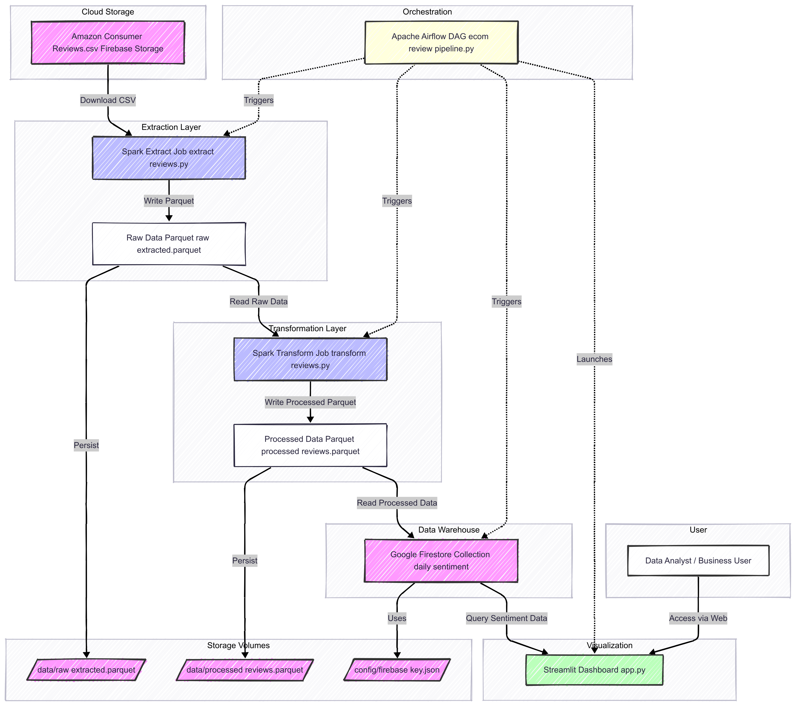
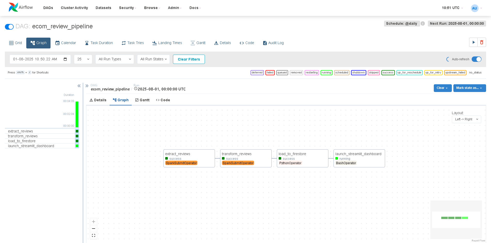
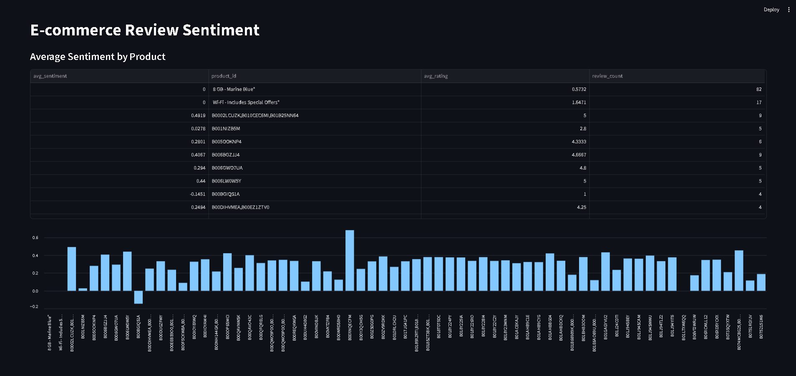

# 🚀 E-commerce Review Sentiment Analytics Pipeline

**A production-ready, cloud-native data pipeline for real-time sentiment analysis of e-commerce product reviews**

[](https://airflow.apache.org/)
[](https://spark.apache.org/)
[](https://firebase.google.com/)
[](https://streamlit.io/)
[](https://www.docker.com/)

---

## 🎯 Project Overview

Transform your e-commerce review data into actionable business insights with this enterprise-grade sentiment analysis pipeline. Built with modern data engineering best practices, this solution automatically processes thousands of customer reviews, extracts sentiment patterns, and delivers real-time analytics through an intuitive dashboard.

### 🌟 Why This Pipeline?

- **📈 Business Impact**: Turn customer feedback into data-driven product decisions
- **⚡ Real-time Processing**: Automated daily sentiment analysis at scale
- **🔄 Production Ready**: Containerized, orchestrated, and cloud-native architecture
- **📊 Actionable Insights**: Interactive dashboards for immediate business intelligence

---

## 🏗️ Architecture & Technology Stack


*Complete data flow from raw reviews to business insights*

### **Data Orchestration Layer**
- **Apache Airflow**: Workflow orchestration with dependency management, scheduling, and monitoring
- **Task Dependencies**: Intelligent DAG structure ensuring data quality and consistency

### **Data Processing Engine**
- **Apache Spark**: Distributed computing for handling large-scale review datasets
- **PySpark**: Python API for scalable data transformations and ML operations
- **Parquet Format**: Columnar storage for optimized analytics performance

### **Cloud Infrastructure**
- **Google Firebase**: Secure cloud storage and NoSQL database
- **Firestore**: Real-time database for storing processed sentiment metrics
- **Docker**: Containerization for consistent deployment environments

### **Analytics & Visualization**
- **TextBlob NLP**: Advanced sentiment analysis with polarity scoring
- **Streamlit**: Interactive web dashboard for business stakeholders
- **Real-time Updates**: Live dashboard reflecting latest sentiment trends

---

## ✨ Key Features


*Automated workflow orchestration with Apache Airflow*

### 🔄 **Automated ETL Pipeline**
- **Smart Scheduling**: Daily automated runs with configurable timing
- **Error Handling**: Robust retry mechanisms and failure notifications
- **Data Validation**: Built-in quality checks at each pipeline stage
- **Monitoring**: Comprehensive logging and performance metrics

### 📊 **Advanced Sentiment Analysis**
- **Multi-dimensional Scoring**: Polarity and subjectivity analysis
- **Product-level Aggregation**: Average sentiment scores per product

### 🚀 **Scalable Data Processing**
- **Distributed Computing**: Spark cluster for handling millions of reviews
- **Memory Optimization**: Efficient data structures and caching strategies
- **Parallel Processing**: Concurrent task execution for faster results
- **Resource Management**: Dynamic scaling based on data volume

### 📈 **Real-time Dashboard**
- **Interactive Visualizations**: Dynamic charts and graphs
- **Product Performance**: Sentiment rankings and comparisons

### 🔒 **Enterprise Security**
- **Firebase Authentication**: Secure cloud data access
- **Environment Variables**: Sensitive data protection
- **Access Control**: Role-based permissions and audit trails
- **Data Encryption**: End-to-end security for customer data

---

## 📁 Project Structure

```
ecommerce-sentiment-pipeline/
├── 🔧 dags/                          # Airflow DAG definitions
│   ├── ecom_review_pipeline.py       # Main orchestration DAG
│   └── load_to_firestore.py         # Data loading operations
├── ⚡ spark_jobs/                    # Distributed processing jobs
│   ├── extract_reviews.py           # Data extraction from sources
│   └── transform_reviews.py         # Sentiment analysis & transformation
├── 📊 streamlit_app/                # Interactive dashboard
│   └── app.py                       # Real-time analytics interface
├── 🔐 config/                       # Configuration & credentials
│   └── firebase_key.json           # Firebase service account
├── 💾 data/                         # Data storage directories
│   ├── raw_extracted.parquet/      # Source review data
│   └── processed_reviews.parquet/  # Analyzed sentiment data
├── 🖼️ images/                       # Documentation assets
├── 🐳 Docker & Config Files
│   ├── requirements.txt            # Python dependencies
│   ├── Dockerfile                  # Container configuration
│   ├── docker-compose.yml          # Multi-service orchestration
│   └── .env                        # Environment variables
└── 📚 README.md                     # Project documentation
```

---

## 🚀 Quick Start Guide

### Prerequisites
- Docker & Docker Compose installed
- Firebase project with Firestore enabled
- 4GB+ RAM for Spark processing

### 1️⃣ **Repository Setup**
```bash
git clone https://github.com/HimadeepRagiri/E-commerce-Review-Sentiment-Analytics-Pipeline.git
cd ecommerce-review-sentiment-pipeline
```

### 2️⃣ **Environment Configuration**
Create your `.env` file with production settings:

```ini
# 🔥 Firebase Configuration
FIREBASE_PROJECT_ID=your-firebase-project-id
FIREBASE_STORAGE_BUCKET=your-firebase-storage-bucket
FIREBASE_CREDENTIALS_PATH=/opt/airflow/config/firebase_key.json

# 💾 Data Paths
DATA_RAW_PARQUET=/opt/airflow/data/raw_extracted.parquet
DATA_PROCESSED_PARQUET=/opt/airflow/data/processed_reviews.parquet

# 🔐 Security
FERNET_KEY=your-airflow-fernet-key
```

**🔑 Generate Fernet Key:**
```bash
python -c "from cryptography.fernet import Fernet; print(Fernet.generate_key().decode())"
```

### 3️⃣ **Firebase Service Account**
1. Go to Firebase Console → Project Settings → Service Accounts
2. Generate new private key
3. Save as `config/firebase_key.json`
4. Ensure Firestore and Storage permissions are enabled

### 4️⃣ **Launch Pipeline**
```bash
# 🚀 Start all services
docker-compose up --build

# Access points:
# 🎛️ Airflow UI: http://localhost:8080 (admin/admin)
# 📊 Dashboard: http://localhost:8501
```

---

## 🔄 Pipeline Deep Dive

### **Data Extraction Stage**
- **Source Integration**: Automated download from Firebase Storage
- **Data Validation**: Schema verification and quality checks  
- **Format Optimization**: Conversion to Parquet for analytics performance
- **Error Recovery**: Automatic retry on network failures

### **Sentiment Transformation**
- **Text Preprocessing**: Cleaning, normalization, and tokenization
- **NLP Analysis**: TextBlob sentiment scoring with confidence metrics
- **Feature Engineering**: Product-level aggregations and statistical measures
- **Performance Optimization**: Spark DataFrame operations for scalability

### **Data Loading & Storage**
- **Firestore Integration**: Structured document storage with indexing
- **Batch Processing**: Efficient bulk operations for large datasets
- **Data Versioning**: Timestamped records for historical analysis
- **Backup Strategy**: Automated data retention and archival

---

## 📊 Dashboard Features


*Interactive sentiment analytics dashboard*

### **Real-time Analytics**
- **Sentiment Overview**: Product-wise sentiment distribution
- **Performance Metrics**: Average ratings

### **Interactive Features**
- **Dynamic Filtering**: Date range, product category, sentiment threshold
- **Responsive Design**: Mobile-friendly interface for on-the-go access

---

## 🔧 Advanced Configuration

### **Airflow Customization**
```python
# Custom DAG schedule
schedule_interval='0 2 * * *'  # Daily at 2 AM UTC

# Resource allocation
executor_config={
    'KubernetesExecutor': {
        'request_memory': '2Gi',
        'request_cpu': '1000m'
    }
}
```

### **Spark Optimization**
```python
# Performance tuning
spark.conf.set("spark.sql.adaptive.enabled", "true")
spark.conf.set("spark.sql.adaptive.coalescePartitions.enabled", "true")
spark.conf.set("spark.serializer", "org.apache.spark.serializer.KryoSerializer")
```

---

## 🧪 Quality Assurance

### **Data Quality Validation**
- Schema validation for incoming data
- Null value and duplicate detection
- Sentiment score range validation
- Product ID consistency checks

### **Manual Testing**
- Pipeline execution verification
- Data validation at each stage
- Dashboard functionality testing
- Firestore integration validation

---

## 🚨 Monitoring & Troubleshooting

### **Common Issues & Solutions**

| Issue | Symptoms | Solution |
|-------|----------|----------|
| **Memory Errors** | Spark job failures | Increase Docker memory allocation |
| **Firebase Timeout** | Connection errors | Check service account permissions |
| **Empty Dashboard** | No data displayed | Verify DAG execution success |
| **Slow Processing** | Long task duration | Optimize Spark partitioning |

### **Health Checks**
- Airflow task success rates
- Spark job execution time monitoring  
- Firestore connection validation
- Dashboard response time tracking

---

## 🔮 Future Enhancements

### **Planned Features**
- **🤖 ML Model Integration**: Advanced sentiment models (BERT, RoBERTa)
- **📱 Mobile App**: Native iOS/Android dashboard
- **🔔 Alert System**: Automated notifications for sentiment anomalies
- **🌐 Multi-language**: Support for international reviews
- **📈 Predictive Analytics**: Sentiment trend forecasting

### **Scalability Roadmap**
- **☁️ Cloud Migration**: AWS/GCP deployment options
- **🔄 Stream Processing**: Real-time sentiment analysis
- **📊 Advanced Visualizations**: Custom D3.js charts
- **🗃️ Data Lake Integration**: Historical data warehouse

---

## 🤝 Contributing

We welcome contributions!

### **Development Workflow**
1. Fork the repository
2. Create feature branch (`git checkout -b feature/amazing-feature`)
3. Commit changes (`git commit -m 'Add amazing feature'`)
4. Push to branch (`git push origin feature/amazing-feature`)
5. Open Pull Request

---

## 📄 License

This project is licensed under the MIT License - see the [LICENSE](LICENSE) file for details.

---

## 🙏 Acknowledgements

Built with industry-leading technologies:

- **[Apache Airflow](https://airflow.apache.org/)** - Workflow orchestration platform
- **[Apache Spark](https://spark.apache.org/)** - Unified analytics engine for big data
- **[Google Firebase](https://firebase.google.com/)** - Cloud application development platform
- **[Streamlit](https://streamlit.io/)** - Data app framework for machine learning
- **[TextBlob](https://textblob.readthedocs.io/)** - Python library for NLP tasks

---

## 📞 Support & Contact

- **📧 Email**: himadeepragiri@gmail.com

---

<div align="center">

**⭐ Star this repository if you find it helpful!**

Made with ❤️ by Ragiri Himadeep

</div>